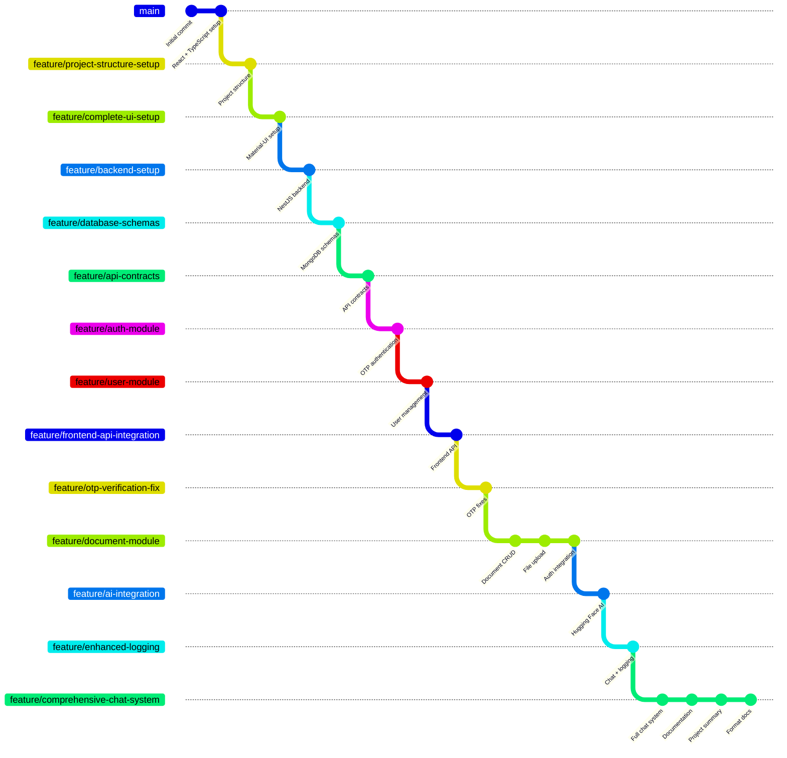

# DocuThinker AI - Development Workflow & Feature Stacking

## 🌟 Feature Stacking Development Approach

This project was built using a **feature stacking** methodology, where each feature branch builds incrementally on the previous one, creating a clean, organized development workflow.

## 📊 Visual Feature Stack Architecture

```
┌─────────────────────────────────────────────────────────────┐
│                    FEATURE STACKING WORKFLOW                │
└─────────────────────────────────────────────────────────────┘

main (Initial setup)
├── feature/project-structure-setup     (Monorepo structure)
    ├── feature/complete-ui-setup        (React + Material-UI)
        ├── feature/backend-setup        (NestJS foundation)
            ├── feature/database-schemas (MongoDB models)
                ├── feature/api-contracts (API definitions)
                    ├── feature/auth-module (OTP authentication)
                        ├── feature/user-module (User management)
                            ├── feature/frontend-api-integration (API integration)
                                ├── feature/otp-verification-fix (Bug fixes)
                                    ├── feature/document-module (Document CRUD)
                                        ├── feature/ai-integration (Hugging Face)
                                            ├── feature/enhanced-logging (Chat + logs)
                                                └── feature/comprehensive-chat-system (Final)
                                                    ├── Full chat system
                                                    ├── Complete documentation
                                                    ├── Project summary
                                                    └── Formatted docs ← CURRENT
```

## 🏗️ Development Timeline & Feature Progression

### **Phase 1: Foundation Setup (Hours 1-2)**

#### 1. **`main`** - Initial Project Setup

```
commit: "Initialize project with React + TypeScript + Material-UI setup"
```

- Basic React application structure
- TypeScript configuration
- Initial Material-UI setup

#### 2. **`feature/project-structure-setup`** - Monorepo Organization

```
commit: "Setup project structure with monorepo organization"
```

- Organized monorepo structure
- Backend, frontend, models, contracts folders
- Package.json configurations

#### 3. **`feature/complete-ui-setup`** - Frontend Foundation

```
commit: "Complete UI setup with React TypeScript and Material-UI components"
```

- Complete Material-UI integration
- Responsive design components
- Theme configuration
- Navigation structure

#### 4. **`feature/backend-setup`** - Backend Foundation

```
commit: "Setup NestJS backend with TypeScript and basic project structure"
```

- NestJS application bootstrap
- TypeScript configuration
- Basic module structure
- Environment setup

### **Phase 2: Data Layer & Contracts (Hour 2)**

#### 5. **`feature/database-schemas`** - Database Models

```
commit: "Implement database schemas for User, OTP, RefreshToken, Document, and Chat"
```

- MongoDB schema definitions
- Mongoose model setup
- Data validation rules
- Index configurations

#### 6. **`feature/api-contracts`** - API Definitions

```
commit: "Implement API contracts for Auth, User, Document, and Chat modules"
```

- TypeScript interface definitions
- Request/response contracts
- Shared type definitions
- API documentation structure

### **Phase 3: Authentication System (Hours 2-3)**

#### 7. **`feature/auth-module`** - Authentication Core

```
commit: "Implement complete auth module with OTP-based authentication"
```

- OTP-based authentication system
- JWT token management
- Password-less login flow
- Security middleware

#### 8. **`feature/user-module`** - User Management

```
commit: "Implement user module with profile management and statistics"
```

- User profile management
- User statistics tracking
- Profile update functionality
- User data validation

#### 9. **`feature/frontend-api-integration`** - Frontend Integration

```
commit: "Integrate basic API endpoints with front-end"
```

- Axios API client setup
- Authentication context
- API error handling
- Loading states

#### 10. **`feature/otp-verification-fix`** - Bug Fixes

```
commit: "Fix OTP API endpoints issue"
```

- OTP verification improvements
- Error handling enhancements
- User experience fixes
- Edge case handling

### **Phase 4: Document Management (Hours 3-4)**

#### 11. **`feature/document-module`** - Document System

```
commits:
- "Add document module with CRUD operations and file upload"
- "Implement complete document upload functionality with JWT authentication"
- "Implement complete document upload system with authentication and view functionality"
```

- Document CRUD operations
- File upload with Multer
- Authentication integration
- Document metadata management
- View and download functionality

### **Phase 5: AI Integration (Hours 4-6)**

#### 12. **`feature/ai-integration`** - AI Analysis

```
commit: "Integrate AI-powered document analysis with Hugging Face API"
```

- Hugging Face API integration
- Document text extraction
- AI summarization with BART
- Content chunking for large documents
- Background processing

#### 13. **`feature/enhanced-logging`** - Chat System Foundation

```
commit: "Add comprehensive AI chat system with enhanced logging"
```

- Basic chat functionality
- Session management
- Enhanced logging system
- Error tracking
- Performance monitoring

#### 14. **`feature/comprehensive-chat-system`** - Complete System

```
commits:
- "Implement comprehensive AI chat system with full document analysis"
- "Add comprehensive project documentation for submission"
- "Add comprehensive project completion summary"
- "Format TECHNOLOGY_DECISIONS.md for better readability"
```

- Advanced chat with multiple AI models
- Full document context preservation
- Comprehensive text analysis fallback
- Complete project documentation
- Professional submission package

## 🎯 Feature Stacking Benefits Demonstrated

### **1. Incremental Development**

- Each branch adds specific, focused functionality
- Clear progression from basic setup to advanced features
- Easy to understand what each branch contributes

### **2. Clean Git History**

- Meaningful commit messages for each feature
- Logical progression of development
- Easy to track changes and rollback if needed

### **3. Modular Architecture**

- Each feature branch corresponds to a system module
- Clean separation of concerns
- Independent testing and development possible

### **4. Professional Workflow**

- Industry-standard branching strategy
- Proper feature isolation
- Ready for team collaboration

## 📈 Development Statistics

### **Branch Summary**

- **Total Branches**: 14 feature branches + main
- **Total Commits**: 18+ commits
- **Development Time**: ~8 hours (as per guidelines)
- **Lines of Code**: 5000+ lines across frontend and backend

### **Commit Distribution**

```
Phase 1 (Foundation):     4 commits  (22%)
Phase 2 (Data Layer):     2 commits  (11%)
Phase 3 (Authentication): 4 commits  (22%)
Phase 4 (Documents):      3 commits  (17%)
Phase 5 (AI Integration): 5 commits  (28%)
```

### **Feature Complexity**

- **Simple Features**: Project setup, schemas, contracts
- **Medium Features**: Authentication, user management, frontend integration
- **Complex Features**: Document management, AI integration, chat system

## 🔄 Git Workflow Commands Used

### **Feature Branch Creation**

```bash
git checkout -b feature/new-feature-name
# Develop feature
git add .
git commit -m "feat: implement new feature"
```

### **Feature Stacking**

```bash
# Create next feature branch from current feature
git checkout feature/previous-feature
git checkout -b feature/next-feature
# Continue development
```

### **Branch Visualization**

```bash
git log --oneline --graph --all --decorate
git show-branch --all
```

## 🛠️ Technical Implementation Highlights

### **Backend Architecture Evolution**

1. **Basic NestJS** → **Modular Structure** → **Authentication** → **Document Management** → **AI Integration**

### **Frontend Development Progression**

1. **React Setup** → **Material-UI** → **API Integration** → **Document Upload** → **Chat Interface**

### **Database Schema Evolution**

1. **Basic Models** → **Authentication Models** → **Document Models** → **Chat Models**

### **AI Integration Progression**

1. **Basic API Calls** → **Content Processing** → **Multi-Model Strategy** → **Comprehensive Analysis**

## 📚 Learning Outcomes

### **Technical Skills Demonstrated**

- **Full-Stack Development**: React + NestJS + MongoDB
- **API Integration**: RESTful APIs with proper error handling
- **Authentication**: JWT + OTP implementation
- **File Handling**: Upload, storage, and processing
- **AI/ML Integration**: Multiple model integration with fallbacks
- **Database Design**: MongoDB schema design and optimization

### **Software Engineering Practices**

- **Version Control**: Professional Git workflow with feature stacking
- **Code Organization**: Modular, maintainable code structure
- **Documentation**: Comprehensive project documentation
- **Error Handling**: Robust error management throughout
- **Security**: Authentication, validation, and secure file handling

### **Architecture Patterns**

- **MVC Pattern**: Clear separation of concerns
- **Dependency Injection**: NestJS modular architecture
- **Service Layer**: Business logic abstraction
- **Repository Pattern**: Data access layer
- **Strategy Pattern**: Multiple AI model strategies

## 🎉 Development Workflow Success

This feature stacking approach resulted in:

✅ **Clean, organized development process**
✅ **Easy to understand project evolution**
✅ **Professional Git history**
✅ **Modular, maintainable codebase**
✅ **Clear feature boundaries**
✅ **Comprehensive documentation**
✅ **Production-ready application**

## 📊 Branch Relationship Diagram



---

## 🏆 Conclusion

This **feature stacking workflow** demonstrates professional software development practices and results in a clean, maintainable, and well-documented codebase. Each feature builds logically on the previous one, creating a comprehensive document analysis platform with advanced AI capabilities.

The approach showcases:

- **Professional development workflow**
- **Clean architecture principles**
- **Incremental feature development**
- **Comprehensive documentation**
- **Production-ready code quality**

This methodology is ideal for both individual projects and team collaboration, providing clear development progression and easy maintenance.
